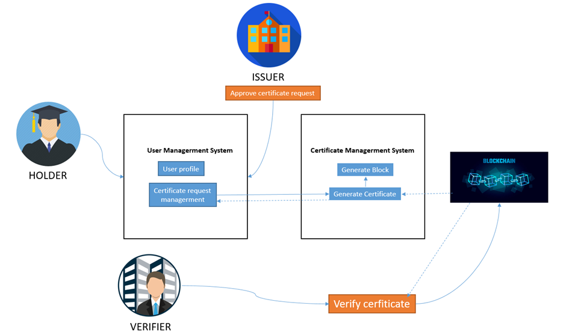
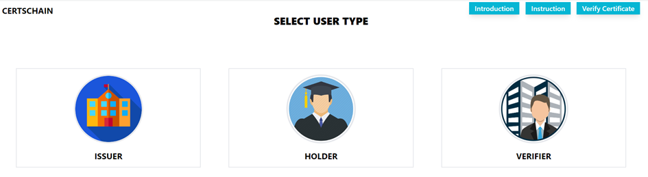

# CertsChain: A Blockchain-Based Certificate Management System

## 1. Introduction:

Blockchain is renowned for its robust security, tamper-proof nature, and transparent information sharing. These unique attributes address the shortcomings of traditional certificate management systems.

As an individual who has always had a passion for exploring new technologies and crafting solutions through code, I embarked on a journey to research blockchain and create this project.

Furthermore, this project serves as a practical demonstration for my Master's graduation thesis.

### **Key features:**

CertsChain comprises three primary components:

- Issuers: These units are responsible for issuing certificates to holders.
- Holders: These units store certificates and have the capability to share them with verifiers.
- Verifiers: Verifiers are units dedicated to validating the certificates of holders.



## 2. Prerequisites:

### **Frontend**

- Vue.js
- TailwindCSS: A tool for rapid UI development
- Vite: A build tool for swiftly creating assets

### **Backend**

- Database: MongoDB with Mongoose
- Framework: Express.js
- Dependencies: pdfkit (for generating PDF files), qrcode (for creating QR codes), sha256 (for hashing data in the blockchain), and more.

## 3. Installation & Preview:

- Install Node.js
- Install MongoDB (with dummy data available in the `"db"` folder; admin user: `cvthang` | `123456`)
- Clone the source code:

### Start the Back-End

- Navigate to the cloned folder, then to the `"be"` folder, and install dependencies by executing:

  ```
  npm install
  ```

- Start the server:

  ```
  npm run start
  ```

- Once started, the server will run locally on port 4000: http://localhost:4000

### Start the Front-End

- Navigate to the cloned folder, then to the `"web"` folder, and install dependencies by running:

  ```
  npm install
  ```

- Start the server:

  ```
  npm run dev
  ```

- After starting, the front-end server will be accessible locally on port 3000: http://localhost:3000

  

## 4. Contact:

- Email: cvthang56th2@gmail.com
